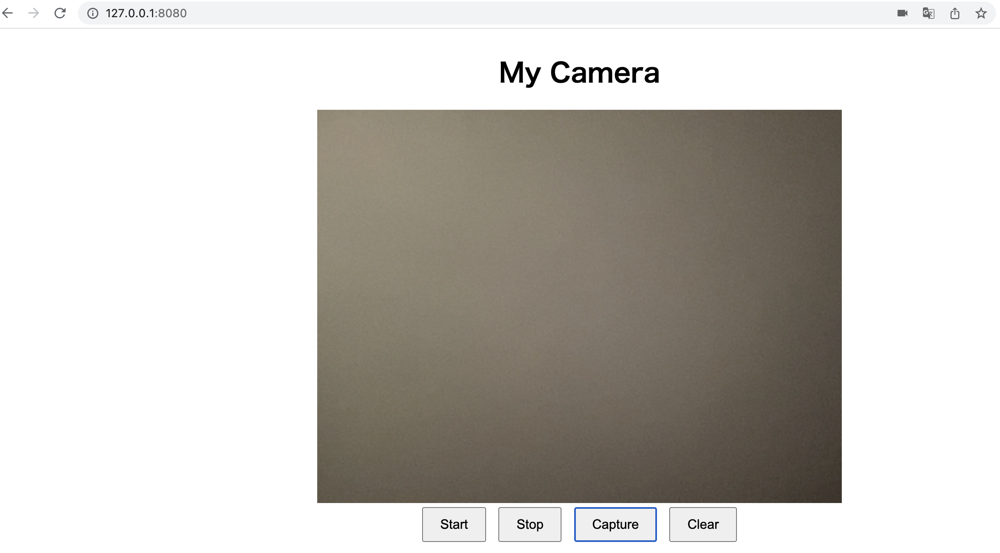
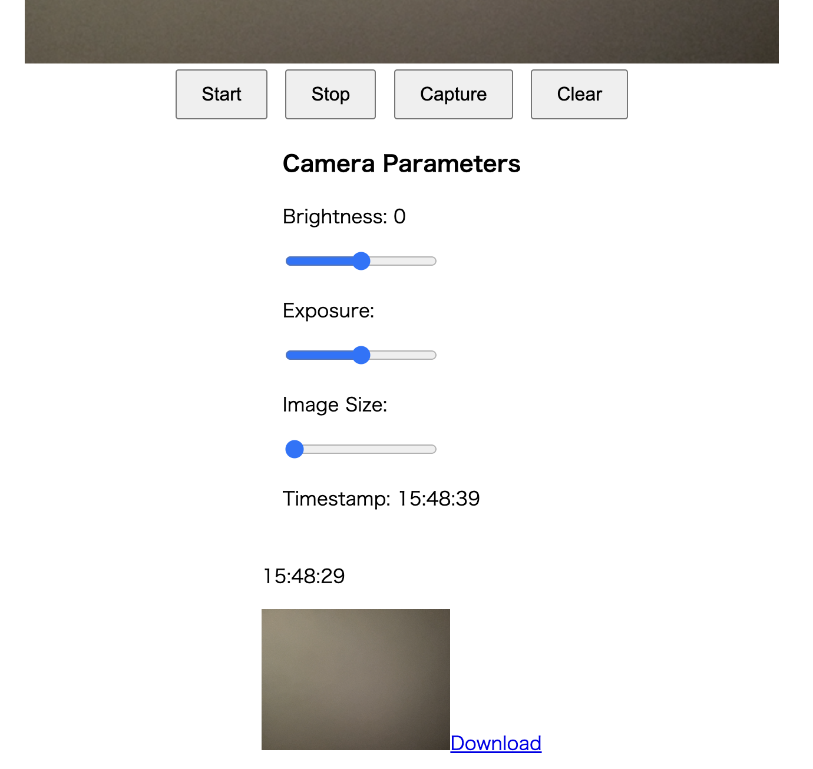
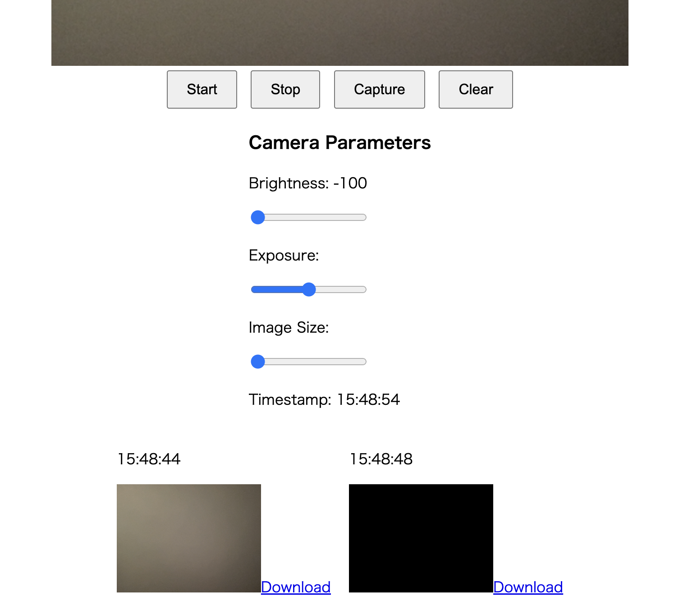
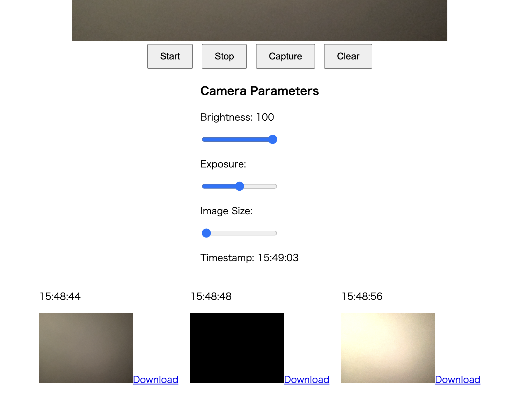
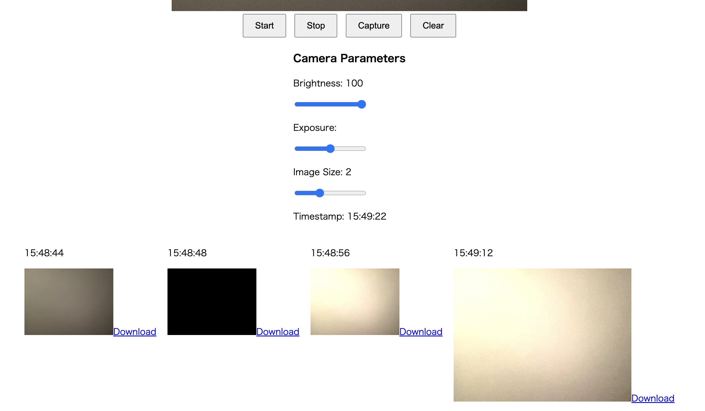

### Task 1: Capture Webcam Image Data by OpenCV
Macでタスク1を実行した。
1. OpenCVライブラリをインストールします。
```
pip install opencv-python opencv-python-headless
```
カメラ画像を処理するために、cv2ライブラリをインポートします。

2. `cv2.VideoCapture`を使ってwebcamにアクセスします。
3. `cv2.imshow` でキャプチャしたフレームを表示します。。
4. ターミナルで、実行します。
```
python Task1.py
```
リアルタイムのWebカメラ画像が表示される「Webcam Stream」という名前のwindowを開きます。'q'キーを押してウィンドウを閉じ、プログラムを停止します。

### Task 2: Stream Image Data In Web Browser GUI using Flask
1. Flaskライブラリと関連する依存関係をインストールします。
```
pip install Flask
```
FlaskライブラリからFlask、render_template、およびResponseクラスをインポートします。これらのクラスはそれぞれ、Webアプリケーションの作成、HTMLテンプレートのレンダリング、およびHTTPレスポンスの構築に使用されます。

2. ルートルート（つまり「/」）を定義し、ユーザーがこのルートにアクセスすると、index()関数が呼び出されます。`index()関数`は、`index.html`テンプレートのレンダリング結果を返します。このテンプレートには、カメラの画像ストリームを表示するための要素が含まれています。
3. `generate_frames()`関数を定義します。これは、カメラのビデオフレームをキャプチャしてJPEG形式にエンコードするための関数です。この関数は、必要に応じて新しいフレームデータを生成できるジェネレータを使用しており、すべてのフレームを一度に生成するのではなく、逐次生成します。

### Task 3: Improve the UI/UX
1. start, stop と captureボタンを追加します。
2. `script.js`で各ボタンのイベントリスナーを作ります。
3. 画像をキャプチャーすることができる


### Task 4: Add Camera Parameters Adjustment DOM
1. Brightness、ExposureとImage Sizeのスライダーを追加します。
2. `script.js`で各スライダーのイベントリスナーを作ります。
3. カメラのパラメータを調整すると、バック側が`172.17.0.1 - - [27/Apr/2023 06:00:34] "POST /update_camera HTTP/1.1" 200 -`というresponseを返します。





### Task 5: Wrap Up the Program Inside a Docker
1. `Dockerfile`を作ります。公式のPython 3.8 slimイメージをベースにしており、作業ディレクトリを「/openCV_kadai」に設定しています。次に、「requirements.txt」ファイルをコンテナにコピーして必要な依存関係をインストールします。最後に、プロジェクトの他のファイルをコンテナにコピーし、「python app.py」という起動コマンドを設定します。
2. ターミナルで、プロジェクトのルートディレクトリに移動し、Dockerイメージをビルドします。
```bash
docker build -t flask-webcam .
```
3. Dockerコンテナを実行します。
```bash
docker run -p 8080:5000 --privileged flask-webcam
```