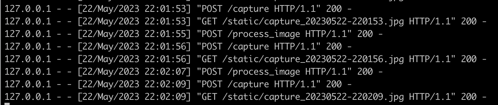

課題について
[My Document](files/(Fullstack)_Realtime_Image_Streaming_using_Flask.pdf
)

### Task 1: Capture Webcam Image Data by OpenCV
Macでタスク1を実行した。
1. OpenCVライブラリをインストールします。
```
pip install opencv-python opencv-python-headless
```
カメラ画像を処理するために、cv2ライブラリをインポートします。

2. `cv2.VideoCapture`を使ってwebcamにアクセスします。
3. `cv2.imshow` でキャプチャしたフレームを表示します。。
4. ターミナルで、実行します。
```
python Task1.py
```
リアルタイムのWebカメラ画像が表示されるwindowを開きます。'q'キーを押してウィンドウを閉じ、プログラムを停止します。

### Task 2: Stream Image Data In Web Browser GUI using Flask
1. Flaskライブラリと関連する依存関係をインストールします。
```
pip install Flask
```
FlaskライブラリからFlask、render_template、およびResponseクラスをインポートします。これらのクラスはそれぞれ、Webアプリケーションの作成、HTMLテンプレートのレンダリング、およびHTTPレスポンスの構築に使用されます。


* Flask アプリケーションを作成
```
app = Flask(__name__)

```

* ルートルート（つまり「/」）を定義し、ユーザーがこのルートにアクセスすると、index()関数が呼び出されます。`index()関数`は、`index.html`テンプレートのレンダリング結果を返します。このテンプレートには、カメラの画像ストリームを表示するための要素が含まれています。
```
# ルートエンドポイント（"/"）を定義
@app.route('/')
def index():
    # index.html をレンダリングして表示
    return render_template('index.html')
```

3. `generate_frames()`関数を定義します。これは、カメラのビデオフレームをキャプチャしてJPEG形式にエンコードするための関数です。この関数は、必要に応じて新しいフレームデータを生成できるジェネレータを使用しており、すべてのフレームを一度に生成するのではなく、逐次生成します。
```
# ビデオフレームを生成する関数
def generate_frames():
    while True:
        if camera is None or not camera.isOpened():
            break
        # カメラからフレームを読み込む
        ret, frame = camera.read()
        # フレームが読み込めなかった場合、ループを抜ける
        if not ret:
            break
        # フレームを JPEG 形式に変換し、バイト列に変換
        _, buffer = cv2.imencode('.jpg', frame)
        frame = buffer.tobytes()
        # フレームを multipart/x-mixed-replace 形式で出力
        yield (b'--frame\r\n'
               b'Content-Type: image/jpeg\r\n\r\n' + frame + b'\r\n')
        time.sleep(0.1)

# ビデオフィードエンドポイントを定義
@app.route('/video_feed')
def video_feed():
    # カメラが存在しない、または開かれていない場合、エラーを返す
    if camera is None or not camera.isOpened():
        return jsonify(error='Camera is closed'), 400
    # レスポンスとしてビデオフレームを返す
    return Response(generate_frames(), mimetype='multipart/x-mixed-replace; boundary=frame')
```

### Task 3: Improve the UI/UX
1. `index.html`start, stop と captureボタンを追加します。
2. `app.py`start, stop と captureのエンドポイントを追加します。

```
/start_camera
/stop_camera
/capture
```
3. `script.js`で各ボタンのイベントリスナー(event listener)を作ります。

* 画像をキャプチャーすることができる


### Task 4: Add Camera Parameters Adjustment DOM
1. Brightness、ExposureとImage Sizeのスライダーを追加します。
* Parametersを更新するエンドポイント
```
/update_camera
```
* OpenCVのビデオキャプチャプロパティを使用して、カメラのパラメータを調整します。
```
    # フォームからbrightness、exposureとimageSizeを取得
    brightness = int(request.form.get('brightness', 0))
    exposure = int(request.form.get('exposure', 1))
    imageSize = int(request.form.get('imageSize', 2))

    # カメラのbrightness、exposureとimageSizeを設定
    camera.set(cv2.CAP_PROP_BRIGHTNESS, brightness)
    camera.set(cv2.CAP_PROP_EXPOSURE, exposure)
    camera.set(cv2.CAP_PROP_FRAME_WIDTH, width)
    camera.set(cv2.CAP_PROP_FRAME_HEIGHT, height)
```
2. `script.js`で各スライダーのイベントリスナーを作ります。

3. カメラのパラメータを調整すると、バック側が`172.17.0.1 - - [27/Apr/2023 06:00:34] "POST /update_camera HTTP/1.1" 200 -`というresponseを返します。


### Task 5: Add Image Operation Functionalities
1. streaming image画像をリアルタイムで操作できるようにするため、マウスダウンイベントリスナーを追加します。
```
function makeDraggable(elementId) {
    const draggableElement = document.getElementById(elementId);

    draggableElement.addEventListener('mousedown', function(event) {
        // マウスが押された時の位置と要素の現在位置を記録
        let shiftX = event.clientX - draggableElement.getBoundingClientRect().left;
        let shiftY = event.clientY - draggableElement.getBoundingClientRect().top;

        // マウスが動いた時に要素を移動
        function onMouseMove(event) {
            draggableElement.style.left = event.clientX - shiftX + 'px';
            draggableElement.style.top = event.clientY - shiftY + 'px';
        }

        // マウスが押された時にマウス移動イベントをリスン
        document.addEventListener('mousemove', onMouseMove);

        // マウスが離された時にマウス移動イベントのリスニングを停止
        draggableElement.addEventListener('mouseup', function() {
            document.removeEventListener('mousemove', onMouseMove);
        });

        // デフォルトのドラッグ行為を防ぐ
        draggableElement.ondragstart = function() {
            return false;
        };
    });
}
```
* 指定された要素をユーザーがマウスで自由にdraggeして移動することができる


### Task 6: Simple Image Processing on Captured Images
1. キャプチャされた画像のカラーからグレーへの変換のため、Gray Imageボタンのエンドポイントとイベントリスナーを追加します。
```
/process_image
```
2. OpenCVの色空間の変換コードを使用する
```
cv2.cvtColor(frame, cv2.COLOR_BGR2GRAY)
```

Gray Imageボタンを押すと、キャプチャされた画像のカラーからグレーへの変換ができる

同じボタンを再度クリックすると、画像処理操作がキャンセルされ、キャプチャされた画像が元のRGB画像として表示されます




### Task 7: Add Another View for Image Data Streaming In Parallel


### Task 8: Wrap Up the Program Inside a Docker
1. `Dockerfile`を作ります。公式のPython 3.8 slimイメージをベースにしており、作業ディレクトリを「/openCV_kadai」に設定しています。次に、「requirements.txt」ファイルをコンテナにコピーして必要な依存関係をインストールします。最後に、プロジェクトの他のファイルをコンテナにコピーし、「python app.py」という起動コマンドを設定します。
2. ターミナルで、プロジェクトのルートディレクトリに移動し、Dockerイメージをビルドします。
```bash
docker build -t flask-webcam .
```
3. Dockerコンテナを実行します。
```bash
docker run -p 8080:3000 --privileged flask-webcam
```
chromeで`http://127.0.0.1:8080/`にアクセスする
